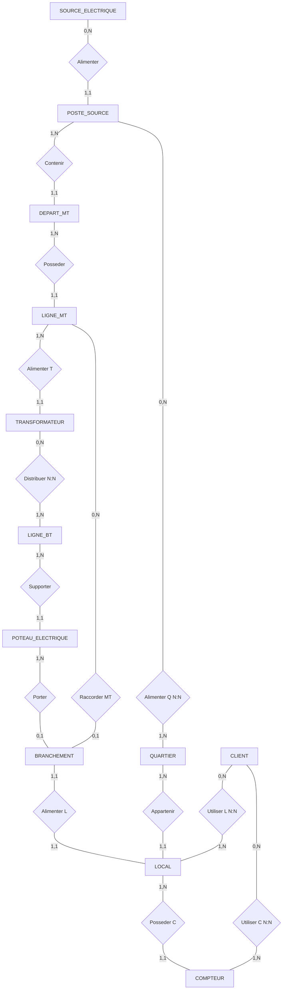

# MCD — Modèle Conceptuel de Données (MERISE)

Niveau **conceptuel** : *quoi* est modélisé, indépendamment de la technique. Entités,
associations et cardinalités (notation MERISE `min,max`). Reflète ADR 0007 + corrections
ADR 0010 (multi-alimentation, clients MT, sens des transfos, phases, poste→quartiers).

## Diagramme (chaîne réseau + clientèle)

## Entités

| Entité | Identifiant | Propriétés principales |
|---|---|---|
| **SOURCE_ELECTRIQUE** | id_source | nom_source, type_source, puissance_mw, *géom (point)* |
| **POSTE_SOURCE** | id_poste_source | nom_poste, tension_entree, tension_sortie, capacite_mva, statut, *géom (point)* |
| **DEPART_MT** | id_depart | nom_depart, tension_kv, longueur_km, etat, *géom (ligne)* |
| **LIGNE_MT** | id_ligne_mt | code_ligne_mt, type_ligne, tension_kv, longueur_km, etat, *géom (ligne)* |
| **TRANSFORMATEUR** | id_transformateur | code, puissance_kva, tension_entree/sortie, **sens** (MT/BT · BT/MT), etat, statut, *géom (point)* |
| **LIGNE_BT** | id_ligne_bt | code_ligne_bt, type_ligne, tension_v, longueur_m, etat, *géom (ligne)* — **réel** |
| **POTEAU_ELECTRIQUE** | id_poteau | code_poteau, type_poteau, hauteur_m, materiau, **phases** (mono·tri), etat, *géom (point)* — **réel** |
| **BRANCHEMENT** | id_branchement | code, type_branchement, longueur_m, date_branchement, etat, *géom (ligne)* |
| **QUARTIER** | id_quartier | nom_quartier, population, superficie, *géom (polygone)* — **réel** |
| **LOCAL** | id_local | code_local, adresse, type_batiment, puissance_demandee, *géom (polygone)* — **réel** |
| **COMPTEUR** | id_compteur | numero_compteur, type_compteur, date_installation, statut, *géom (point)* |
| **CLIENT** | id_client | nom_client, telephone, adresse |

## Associations & cardinalités

| Association | Entité A (min,max) | Entité B (min,max) | Sens métier |
|---|---|---|---|
| Alimenter (source) | SOURCE_ELECTRIQUE (0,N) | POSTE_SOURCE (1,1) | une centrale alimente plusieurs postes source |
| Contenir | POSTE_SOURCE (1,N) | DEPART_MT (1,1) | un poste contient plusieurs départs MT |
| Posséder (départ) | DEPART_MT (1,N) | LIGNE_MT (1,1) | un départ porte plusieurs lignes MT |
| Alimenter (transfo) | LIGNE_MT (1,N) | TRANSFORMATEUR (1,1) | une ligne MT alimente plusieurs transfos |
| **Distribuer** | TRANSFORMATEUR (0,N) | LIGNE_BT (1,N) | **N:N** — une ligne BT peut avoir plusieurs transfos (ADR 0010 #2) |
| Supporter | LIGNE_BT (1,N) | POTEAU_ELECTRIQUE (1,1) | une ligne BT passe par plusieurs poteaux |
| Porter | POTEAU_ELECTRIQUE (1,N) | BRANCHEMENT (0,1) | un poteau porte plusieurs branchements (BT) |
| **Raccorder MT** | LIGNE_MT (0,N) | BRANCHEMENT (0,1) | **client MT** : branchement raccordé en MT (ADR 0010 #1) |
| Alimenter (local) | BRANCHEMENT (1,1) | LOCAL (1,1) | un branchement alimente un local |
| Appartenir | QUARTIER (1,N) | LOCAL (1,1) | un quartier regroupe plusieurs locaux |
| Posséder (compteur) | LOCAL (1,N) | COMPTEUR (1,1) | un local possède plusieurs compteurs |
| **Alimenter (quartier)** | POSTE_SOURCE (0,N) | QUARTIER (1,N) | **N:N** — un poste alimente plusieurs quartiers (ADR 0010 #4) |
| **Utiliser (local)** | CLIENT (0,N) | LOCAL (1,N) | **N:N** — un client a plusieurs locaux, un local plusieurs clients |
| **Utiliser (compteur)** | CLIENT (0,N) | COMPTEUR (1,N) | **N:N** — un client a plusieurs compteurs |

> **Contrainte BRANCHEMENT** : un branchement est rattaché **soit** à un poteau (BT) **soit** à
> une ligne MT (client industriel) — au moins l'un des deux (cf. MPD, `CHECK`).

## Différé (non encore conceptuel)

- Entité **RUE** entre QUARTIER et LOCAL (on s'arrête à `Alimenter (quartier)`).
- **N:N complet SUPPORTER** (un poteau portant plusieurs lignes MT+BT+éclairage) — aujourd'hui
  un poteau a une ligne BT principale + l'attribut `phases`.
