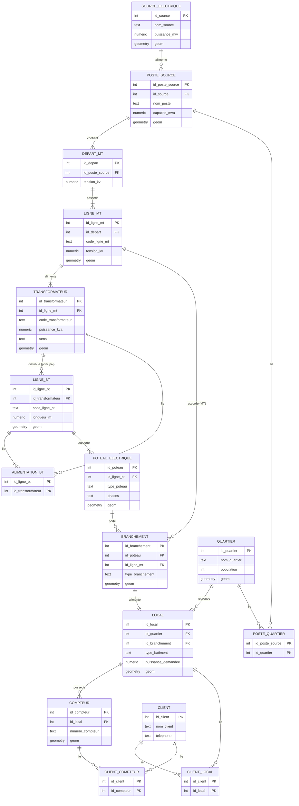

# MLD / MRD — Modèle Logique / Relationnel de Données

Traduction relationnelle du MCD : chaque association **1:N** devient une **clé étrangère** ;
chaque association **N:N** devient une **table de jonction**. Notation : <u>clé primaire</u>,
`#clé_étrangère`.

## Schéma relationnel (texte)

```
SOURCE_ELECTRIQUE(id_source, nom_source, type_source, puissance_mw, geom)
POSTE_SOURCE(id_poste_source, nom_poste, tension_entree, tension_sortie, capacite_mva,
             #id_source, date_mise_service, statut, geom)
DEPART_MT(id_depart, nom_depart, tension_kv, longueur_km, etat, #id_poste_source, geom)
LIGNE_MT(id_ligne_mt, code_ligne_mt, type_ligne, tension_kv, longueur_km, etat,
         #id_depart, date_mise_service, geom)
TRANSFORMATEUR(id_transformateur, code_transformateur, puissance_kva, tension_entree,
               tension_sortie, etat, statut, sens, #id_ligne_mt, date_mise_service, geom)
LIGNE_BT(id_ligne_bt, code_ligne_bt, type_ligne, tension_v, longueur_m, etat,
         #id_transformateur, date_mise_service, geom)          -- id_transformateur = alim. PRINCIPALE
POTEAU_ELECTRIQUE(id_poteau, code_poteau, type_poteau, hauteur_m, materiau, phases, etat,
                  #id_ligne_bt, geom)
BRANCHEMENT(id_branchement, code_branchement, type_branchement, longueur_m, date_branchement,
            etat, #id_poteau, #id_ligne_mt, geom)               -- id_poteau OU id_ligne_mt
QUARTIER(id_quartier, nom_quartier, population, superficie, geom)
LOCAL(id_local, code_local, adresse, type_batiment, puissance_demandee,
      #id_quartier, #id_branchement, geom)                      -- id_branchement UNIQUE (1:1)
COMPTEUR(id_compteur, numero_compteur, type_compteur, date_installation, statut, #id_local, geom)
CLIENT(id_client, nom_client, telephone, adresse)

-- Tables de jonction (N:N)
ALIMENTATION_BT(#id_ligne_bt, #id_transformateur)               -- ligne BT ↔ transfos
POSTE_QUARTIER(#id_poste_source, #id_quartier)                  -- poste ↔ quartiers
CLIENT_LOCAL(#id_client, #id_local)                            -- client ↔ locaux
CLIENT_COMPTEUR(#id_client, #id_compteur)                       -- client ↔ compteurs

-- Référence & métier transverse
PARAMETRE(cle, valeur, note)                                    -- cos_phi, foisonnement, seuils
COUPURE(id_coupure, type, statut, actif_type, actif_id, code_actif, cause, debut, fin,
        clients_affectes, charge_kva, ens_kwh, source, commentaire, cree_le)  -- réf. polymorphe
```

## Diagramme entité-association (relationnel)



## Notes de passage MCD → MLD

- **1:1 BRANCHEMENT–LOCAL** : la clé `#id_branchement` est portée par `LOCAL` avec contrainte
  `UNIQUE` (un branchement n'alimente qu'un local).
- **Distribuer (N:N)** : table `ALIMENTATION_BT`. `LIGNE_BT.#id_transformateur` est conservé en
  plus comme **alimentation principale** (rétro-compatibilité des vues / requêtes simples).
- **Raccorder MT (client MT)** : `BRANCHEMENT.#id_ligne_mt` (nullable). Un branchement a soit
  `#id_poteau` (BT) soit `#id_ligne_mt` (MT) — `CHECK` au niveau physique.
- **COUPURE** ne porte pas de FK : `(actif_type, actif_id)` est une **référence polymorphe**
  (poste/transfo/ligne) et l'impact est figé en snapshot à la déclaration (ADR 0009).
- **Vues** (pas des tables) : `v_charge_transformateur`, `v_charge_ligne` — calcul de charge.
