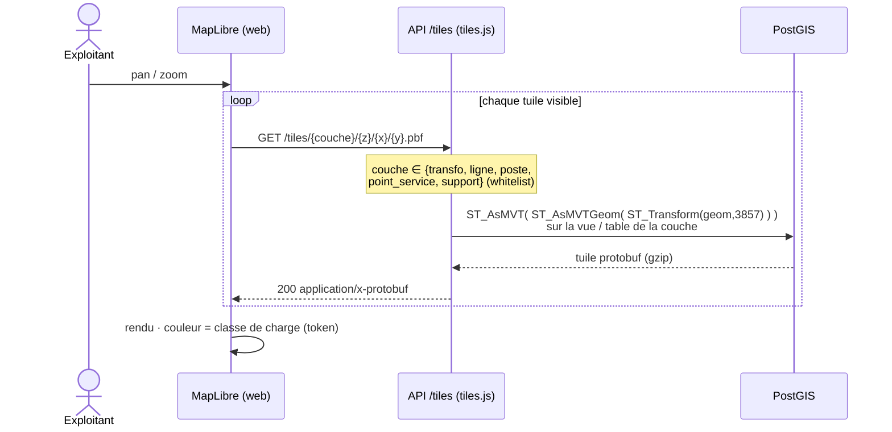
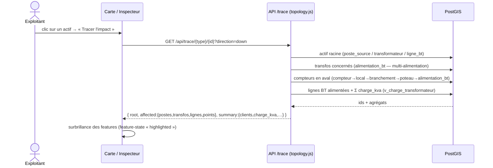
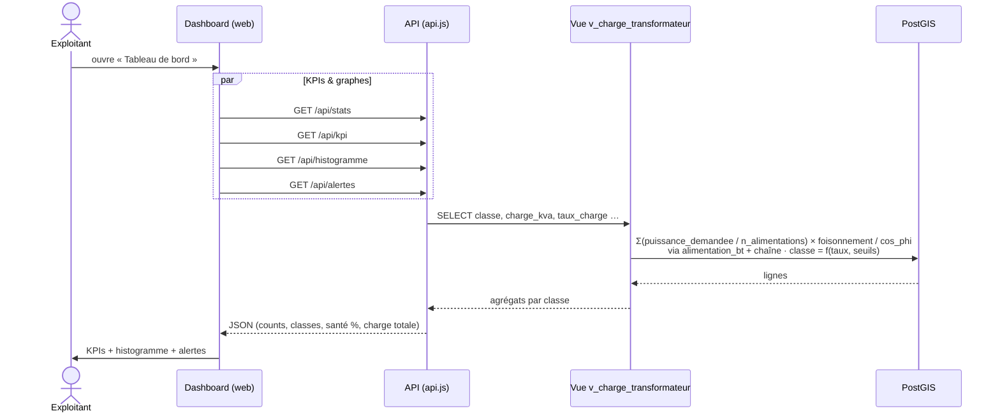
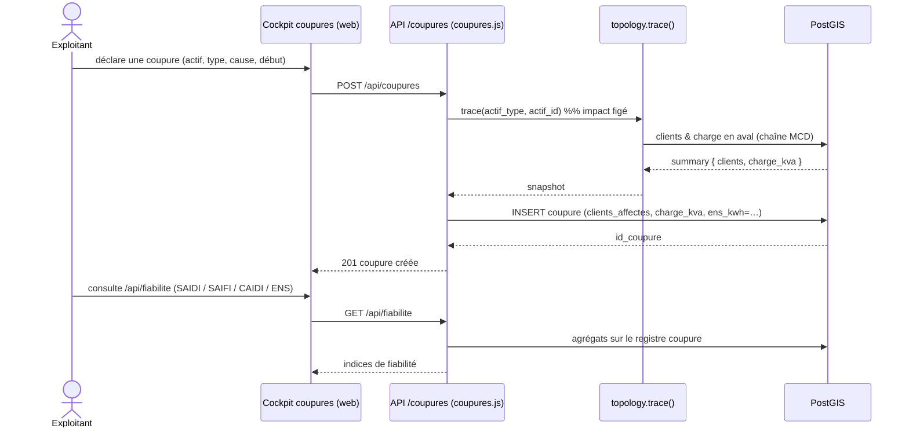
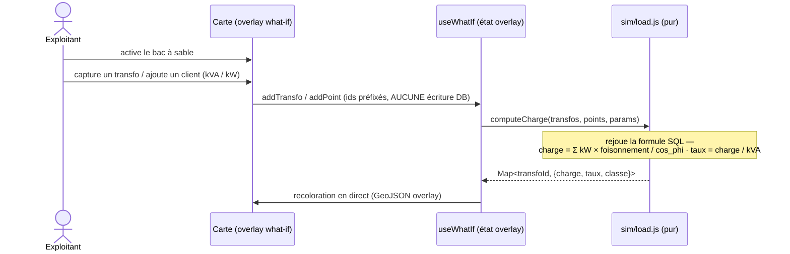

# Diagrammes de séquence — flux clés

Les cinq parcours qui exercent le modèle de données. Acteurs : **Web** (React/MapLibre),
**API** (Express), **DB** (PostGIS).

## 1. Affichage de la carte — tuiles vectorielles (MVT)

## 2. Traçabilité — impact amont/aval d'un actif

## 3. Tableau de bord — calcul de charge & surcharges

## 4. Déclaration d'une coupure (ADR 0009)

## 5. Simulation « what-if » (cœur pur, côté client)

