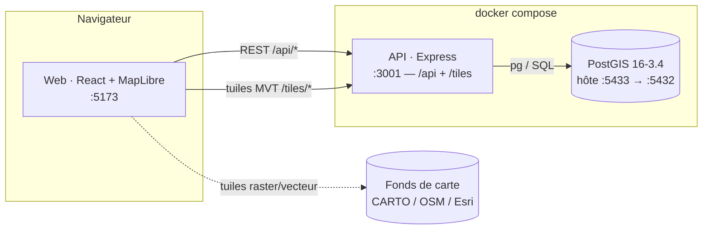
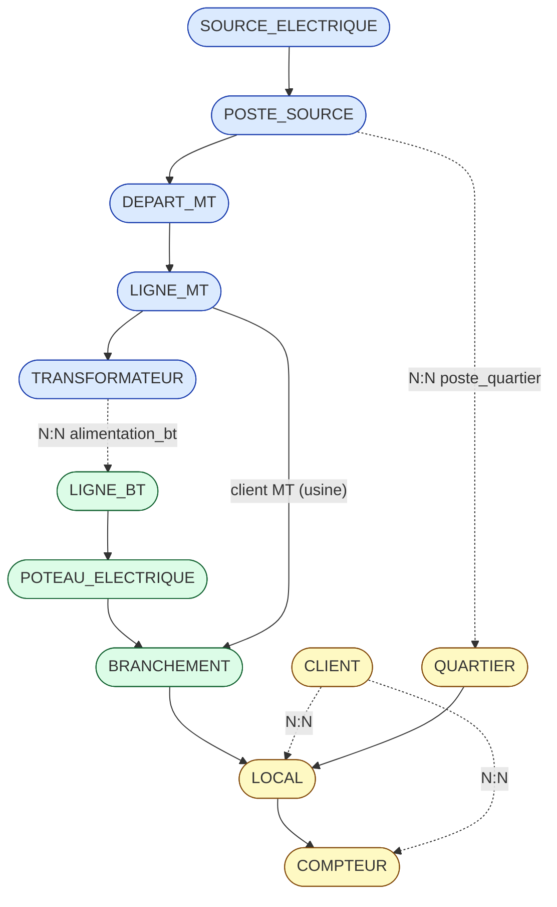
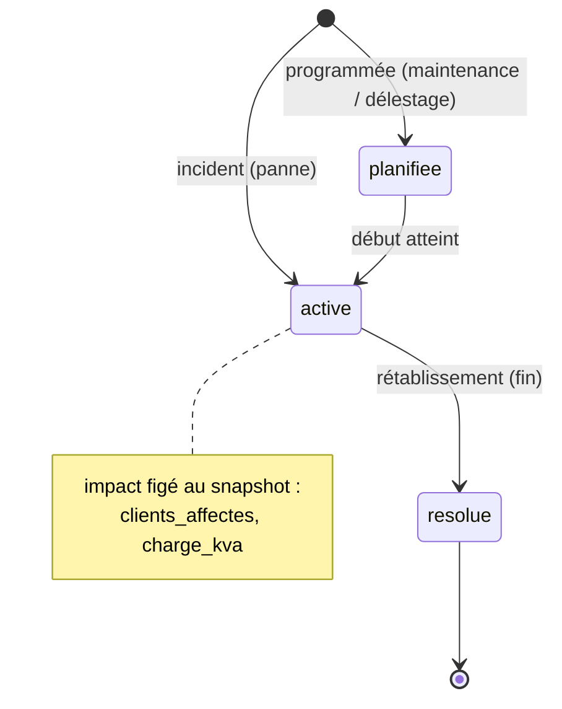
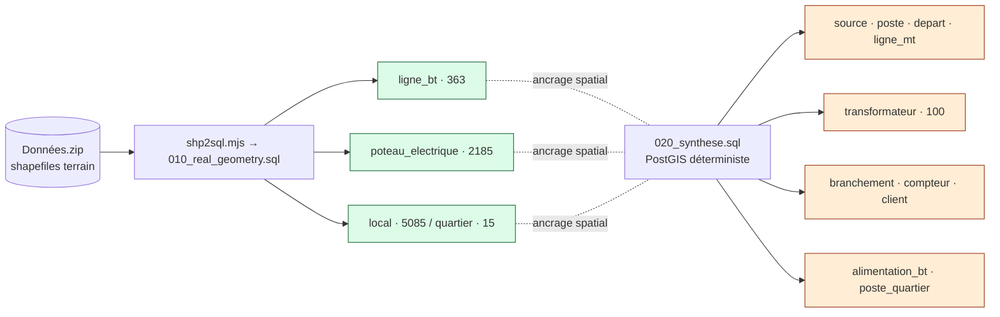

# Visualisations recommandées

Au-delà des modèles MERISE : les schémas et écrans que je recommande pour exploiter la base.

## 1. Architecture de déploiement

## 2. Graphe de topologie réseau (chaîne électrique)

## 3. Cycle de vie d'une coupure (ADR 0009)

## 4. Lignée des données — réel vs synthétique

> **Vert = terrain réel** (géométrie). **Orange = synthétisé** (réseau MT, transfos, clientèle,
> connectivité). Toute l'analyse de charge/twin/coupures dérive de la couche synthétique.

## 5. Écrans & couches cartographiques recommandés

| Visualisation | Données mobilisées | État |
|---|---|---|
| **Carte de surcharge** (transfos/lignes colorés par `classe`) | v_charge_transformateur, v_charge_ligne | ✅ en place |
| **Tableau de bord fiabilité** (KPIs, histogramme, alertes) | /stats, /kpi, /histogramme, /alertes | ✅ |
| **Traçabilité amont/aval** (surbrillance d'impact) | /trace (alimentation_bt) | ✅ |
| **Cockpit coupures** (registre + SAIDI/SAIFI/CAIDI/ENS) | coupure, /fiabilite | ✅ (ADR 0009) |
| **Pertes non techniques** (zones suspectes) | /pertes (densité × calibre) | ✅ |
| **Prévision de saturation** (curseur temporel) | /prevision | ✅ |
| **Couche clients MT** (usines raccordées en MT) | branchement.id_ligne_mt, local industriel | ▶ à exposer (modèle prêt) |
| **Lignes BT multi-alimentées** (surbrillance) | alimentation_bt (90 lignes) | ▶ à exposer |
| **Couverture poste → quartiers** (emprise desservie) | poste_quartier + quartier.geom | ▶ à exposer |
| **Supports par phases** (mono/tri) | poteau_electrique.phases | ▶ à exposer |
| **Sens des transformateurs** (abaisseur/élévateur) | transformateur.sens | ▶ à exposer |

✅ = déjà dans l'app · ▶ = donnée disponible (ADR 0010), reste à afficher côté UI.

## 6. Recommandations de mise en œuvre (UI)

- **Filtres** : ajouter `sens` (MT/BT · BT/MT), `phases` (mono · tri) et un bascule
  « clients MT » dans le panneau de couches (mêmes conventions que les filtres existants).
- **Légende** : distinguer une **ligne BT multi-alimentée** (p.ex. liseré) — c'est le signal
  le plus utile pour l'exploitant (redondance / report de charge).
- **Inspecteur** : sur un transformateur, lister ses **lignes BT alimentées** et sa part de
  charge ; sur un local industriel, afficher le **raccordement MT**.
- **Carte choroplèthe** : `quartier` coloré par charge agrégée ou par poste desservant
  (via `poste_quartier`) — vue « territoire » complémentaire de la vue « actif ».
